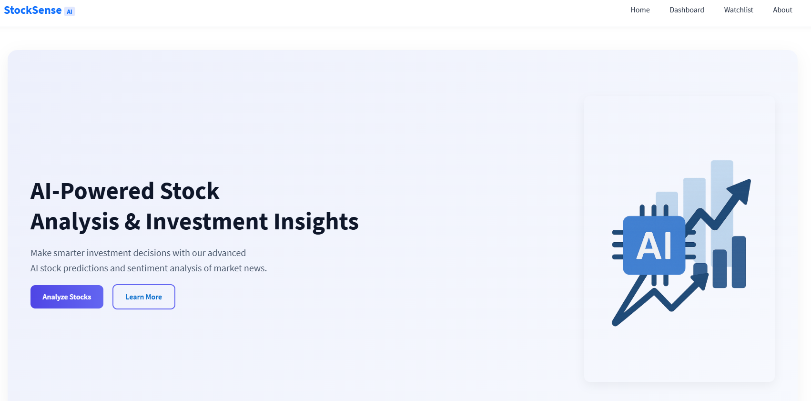
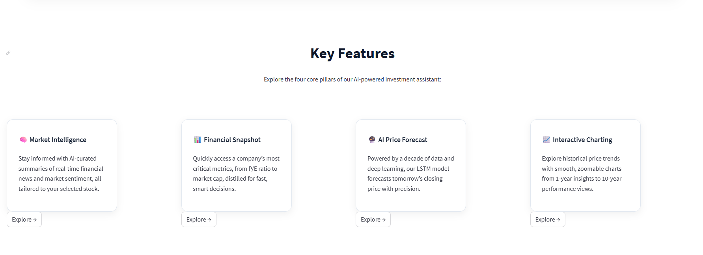
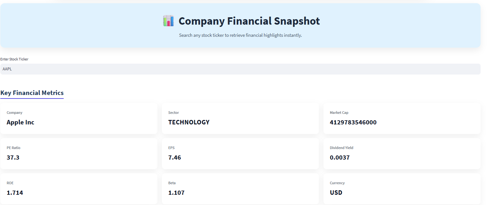
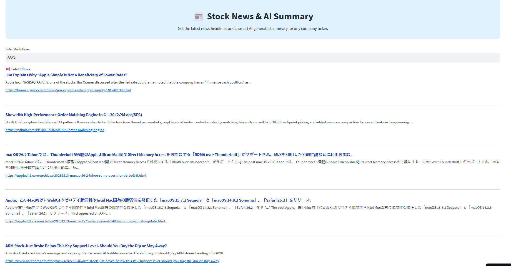
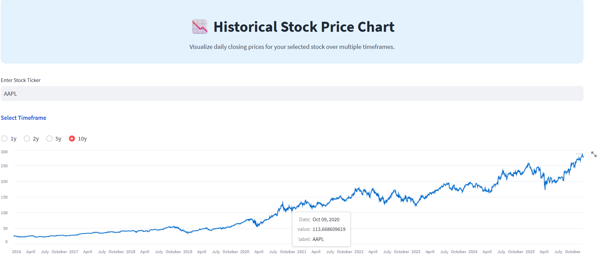
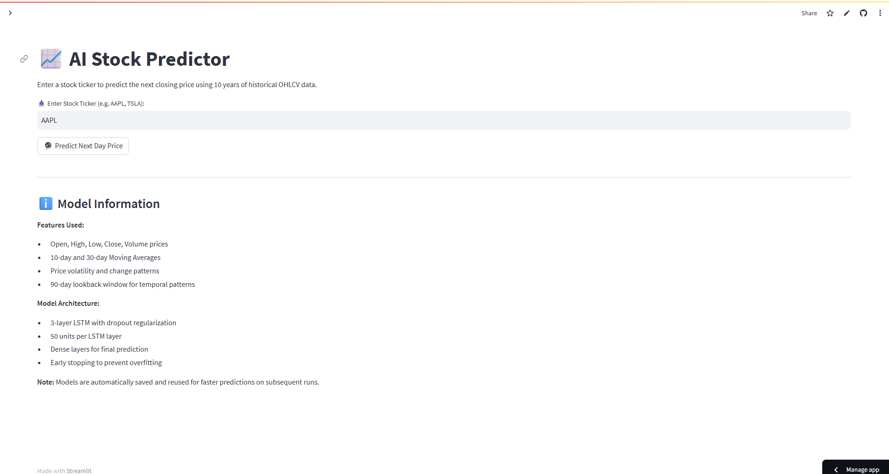

# StockSense AI 📈🤖  
**AI-powered stock analysis & investment insights** — financial snapshot, news + AI summary, interactive historical charts, and a next-day price forecast using an LSTM model.

> A portfolio project showcasing financial data retrieval, visualization, NLP-style summarization, and deep learning forecasting in a single end-to-end app.

---

## ⚠️ Disclaimer (Important)
This project is for **educational and informational purposes only**. It does **not** provide financial advice, investment advice, trading advice, or recommendations to buy/sell any security.  
Market data and news may be delayed, incomplete, or inaccurate. Model outputs are probabilistic and can be wrong.  
Always do your own research and consult a licensed financial professional before making investment decisions.

---

## Overview
StockSense AI is a streamlined app that lets you enter a stock ticker (e.g., `AAPL`) and instantly explore:

- **Company Financial Snapshot** — key fundamentals at a glance  
- **Stock News + AI Summary** — recent headlines and a condensed summary  
- **Historical Stock Price Chart** — multi-timeframe visual trends  
- **AI Stock Predictor (LSTM)** — next-day closing price estimate from historical OHLCV data  

---

## Screenshots

### Home
A clean landing experience introducing the product and the main workflow.



### Key Features
The platform is organized around four pillars: market intelligence, financial snapshot, AI price forecast, and interactive charting.



---

## Core Modules

## 1) Company Financial Snapshot
Search a ticker to retrieve key financial highlights instantly, such as:
- Company / Sector  
- Market Cap  
- P/E Ratio  
- EPS  
- Dividend Yield  
- Beta  
- ROE  
- Currency  

This section is designed to provide **fast context** before deeper analysis.



---

## 2) Stock News & AI Summary
Fetches recent news headlines for the selected ticker and generates a compact summary to help you quickly understand:
- What the market is reacting to  
- Key events and narratives shaping sentiment  
- Recent announcements (earnings, guidance, macro drivers, product updates, etc.)  

This reduces time spent opening multiple sources and scanning long articles.



---

## 3) Historical Stock Price Chart
Interactive price history with selectable timeframes (e.g., 1Y / 2Y / 5Y / 10Y).  
Useful for:
- Identifying long-term trend direction  
- Spotting volatility and drawdowns  
- Comparing recent momentum vs older cycles  



---

## 4) AI Stock Predictor (LSTM Forecast)
Predicts the **next closing price** using ~10 years of historical OHLCV data.

### Features Used (typical)
- Open, High, Low, Close, Volume  
- Moving averages (e.g., 10-day / 30-day)  
- Volatility and change-based patterns  
- Lookback-window temporal signals  

### Model Architecture (high-level)
- Multi-layer **LSTM** network  
- Dropout regularization  
- Dense layers for final regression output  
- Early stopping to reduce overfitting  

> Note: Predicting stock prices is inherently difficult. This model demonstrates an applied ML workflow, not guaranteed profitability.



---

## Typical User Flow
1. Enter a ticker (e.g., `AAPL`)  
2. Review snapshot metrics for quick context  
3. Read latest news + AI summary  
4. Explore historical trends on the chart  
5. Run the LSTM predictor for a next-day estimate  

---

## Tech Stack (edit to match your repo)
- **Python**
- **Streamlit** (UI)
- **Pandas / NumPy** (data processing)
- **Matplotlib / Plotly** (visualizations)
- **TensorFlow / Keras** (LSTM model)
- Financial data + news APIs (provider varies)

---

## Project Structure (example — edit if needed)
- `app.py` / `main.py` — application entrypoint  
- `models/` — saved ML models (if included)  
- `utils/` — helper functions (API calls, preprocessing, etc.)  
- `stockimages/` — screenshots used in this README  
- `requirements.txt` — dependencies  

---

## Run Locally (edit commands if your entry file differs)

### 1) Clone the repo
```bash
git clone https://github.com/IshanKhanijo/stocksenseai.git
cd stocksenseai
```md
### 2) Create & activate a virtual environment (recommended)

**Windows (PowerShell)**
```powershell
python -m venv .venv
.\.venv\Scripts\Activate.ps1
```

**macOS / Linux**
```bash
python3 -m venv .venv
source .venv/bin/activate
```

### 3) Install dependencies
```bash
pip install -r requirements.txt
```

> If you don’t have a `requirements.txt` yet, generate one after installing your libs:
```bash
pip freeze > requirements.txt
```

### 4) Add environment variables (API keys)
Create a `.env` file in the project root (same level as `app.py` / `main.py`):

```env
# Example (rename keys to match your code)
FINANCE_API_KEY=your_key_here
NEWS_API_KEY=your_key_here
OPENAI_API_KEY=your_key_here
```

**Important:** never commit `.env` to GitHub. Add it to `.gitignore`.

### 5) Run the app
If your entry file is `app.py`:
```bash
streamlit run app.py
```

If your entry file is `main.py`:
```bash
streamlit run main.py
```

Open the local URL Streamlit prints in the terminal (typically `http://localhost:8501`).

---

## Configuration Notes
- **Ticker format:** use standard tickers like `AAPL`, `MSFT`, `TSLA`.  
- **Data provider limits:** free tiers may have rate limits, delayed quotes, or missing endpoints.
- **News coverage:** headlines can vary by provider and may be delayed or incomplete.

---

## Model Notes (LSTM Forecast)
This project uses a next-day closing price forecast to demonstrate an applied deep learning workflow:

- Train/test split on historical OHLCV time series  
- Lookback window to build sequences  
- Scaling/normalization during training  
- LSTM layers + dropout + dense regression head  
- Early stopping to reduce overfitting  

**Interpretation tip:** treat the output as a *directional/educational signal*, not a trading strategy.

---

## Limitations
- Stock price forecasting is noisy and influenced by external factors not captured in OHLCV alone (macro events, earnings surprises, guidance, sentiment shifts, etc.).
- Model performance can degrade across regimes (high volatility vs stable markets).
- News summarization may miss nuance, context, or be impacted by article availability.

---

## Roadmap (Optional Enhancements)
- Add sentiment scoring per headline and trend it over time  
- Support multiple tickers / watchlist mode  
- Add backtesting utilities + baseline comparisons (ARIMA / Prophet / XGBoost)  
- Add model evaluation section (MAE/RMSE) per ticker  
- Dockerize the app for easier deployment  
- Cache API responses (Streamlit caching) to reduce rate limit issues  

---

## Contact
**Ishan Khanijo**  
- GitHub: https://github.com/IshanKhanijo  
- Project Repo: https://github.com/IshanKhanijo/stocksenseai  

---

### Acknowledgements
- Streamlit for rapid UI development  
- Pandas/NumPy for data processing  
- TensorFlow/Keras for the LSTM workflow  
- Market/news data providers used by the app (as configured in your code)

---
